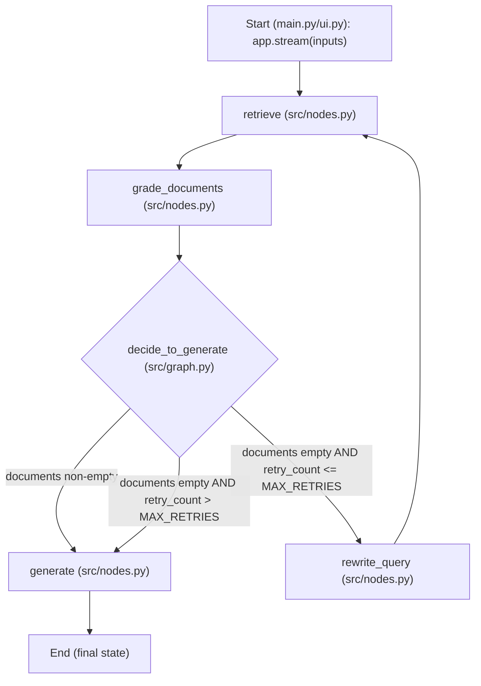
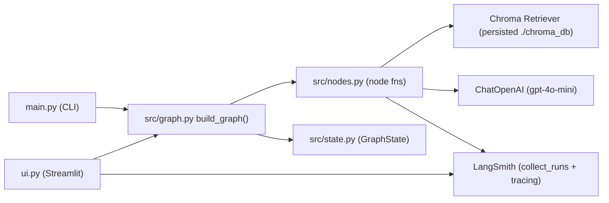
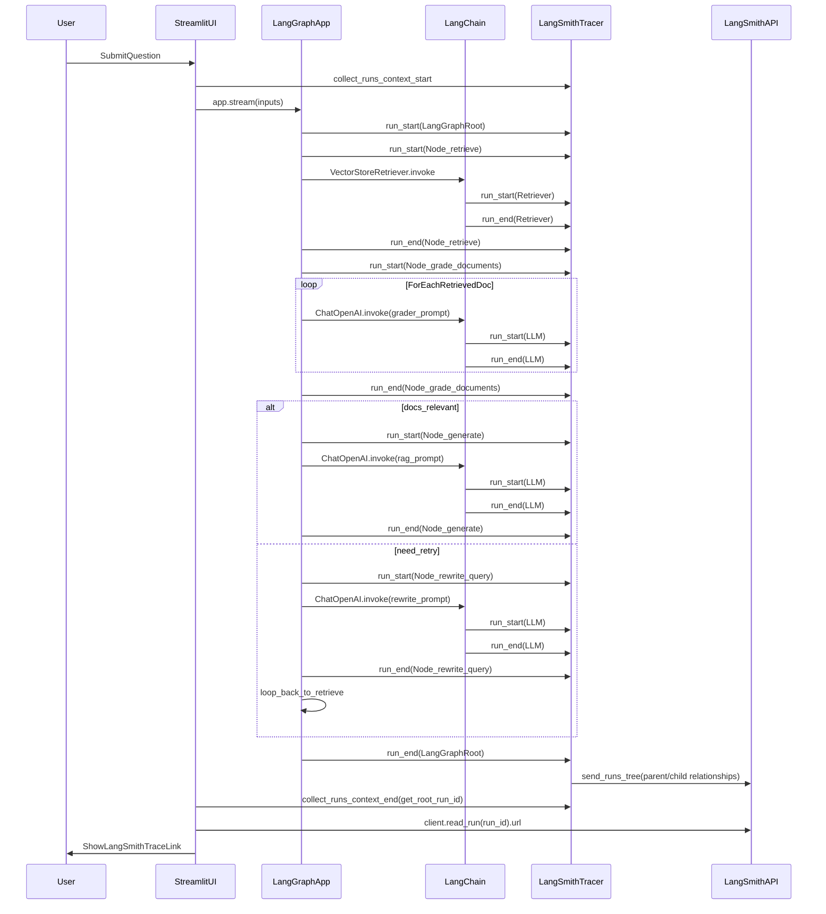

## Self-Correcting Researcher (RAG + LangGraph + LangSmith + Streamlit)

This repo implements a **self-correcting RAG agent**:
- It retrieves candidate context from a persistent vector store (Chroma).
- It uses an LLM to **grade retrieval quality**.
- If retrieval is bad, it **rewrites the query** and tries again (bounded retries).
- Once enough relevant context exists (or we hit the retry limit), it **generates** a final answer.

The implementation is intentionally small so it’s easy to study and extend.

### Quick links
- Architecture & flow diagrams: `diagram.md`
- Streamlit UI: `ui.py`
- CLI runner: `main.py`
- Graph wiring: `src/graph.py`
- Node logic: `src/nodes.py`
- State model: `src/state.py`

---

## Project structure

```text
self-correcting-researcher/
├── chroma_db/              # Persistent Vector DB (generated at runtime; not committed)
├── src/
│   ├── graph.py            # The "Brain": Defines the workflow and decision logic
│   ├── nodes.py            # The "Muscles": Actual functions (Search, Grade, Write)
│   └── state.py            # The "Memory": Data passed between steps
├── ui.py                   # Streamlit Frontend
├── main.py                 # CLI Execution script
├── .env                    # API Keys (Not committed)
├── pyproject.toml          # Dependencies
└── README.md               # Documentation
```

---

## Architecture & code flow

The workflow is defined in `src/graph.py` and uses four nodes implemented in `src/nodes.py`:

- **retrieve**: get candidate chunks from Chroma
- **grade_documents**: LLM relevance filter (per-chunk yes/no)
- **rewrite_query**: query optimizer used only when retrieval is bad
- **generate**: final answer generation (RAG)

See `diagram.md` for diagrams and detailed notes. The same diagrams are embedded below for convenience.

### Embedded architecture & flow diagrams

#### High-level control flow (LangGraph)



#### Module responsibilities



#### State fields that drive behavior

- `question`: original user question or rewritten query
- `documents`: retrieved docs (then filtered by `grade_documents`)
- `retry_count`: increments when *no* relevant docs are found, used to stop infinite loops
- `generation`: final answer (set by `generate`)

#### Trace/debug fields (LangSmith-friendly, metadata-only)

These fields are returned by nodes so you can inspect behavior in LangSmith without logging raw text:

- `retrieved_docs_meta` (from `retrieve`): per-doc metadata (often includes `source`) + index
- `doc_grades` (from `grade_documents`): per-doc pass/fail + grade + metadata
- `used_docs_meta` (from `generate`): metadata for the final docs used to answer

---

## How to run

### Prerequisites
- Python 3.12.x (repo is pinned to 3.12 in `pyproject.toml`)
- OpenAI API key
- LangSmith API key (optional, but recommended)

### 1. Installation
Clone the repository and install dependencies using `uv` (recommended) or `pip`.

```bash
# Using uv (Fast)
uv sync

# OR using standard pip
pip install -r requirements.txt
```

### 2. Configuration
Create a `.env` file in the root directory:

```bash
OPENAI_API_KEY=sk-proj-your-key...
LANGCHAIN_TRACING_V2=true
LANGCHAIN_ENDPOINT=https://api.smith.langchain.com
LANGCHAIN_API_KEY=lsv2-your-key...
LANGCHAIN_PROJECT="Self-Correcting-Researcher"
```

### 3. Execution

#### Option A: Web UI (Streamlit)
This provides a visual interface with a "Thinking Waterfall" and direct links to LangSmith traces.

```bash
streamlit run ui.py
```

If `streamlit run ui.py` fails on Windows with **"Failed to canonicalize script path"**, use:

```bash
python -m streamlit run .\ui.py
```

#### Option B: CLI (Terminal)
Runs the agent in the command line for quick testing.

```bash
python main.py
```

---

## LangSmith (tracing + how to interpret runs)

If `LANGCHAIN_TRACING_V2=true` and `LANGCHAIN_API_KEY` are set, LangSmith will capture a trace per run.

### How LangSmith decides what to track

LangSmith does not “watch your code” automatically. Instead:
- **LangChain/LangGraph emit tracing events** (start/end + inputs/outputs) during execution via a callback/tracer system.
- When tracing is enabled, a **LangSmith tracer** records those events as a tree of **runs** (spans) and sends them to the LangSmith backend.

In practical terms: anything executed through LangChain’s **Runnable** stack (LLMs, retrievers, chains, tools, etc.) becomes traceable.

### End-to-end tracing flow (what happens when you click Submit)

This is the “plumbing” from your app to LangSmith:



### What you’ll see in the trace
- A top-level **LangGraph** run for the whole execution
- Child runs for each node (`retrieve`, `grade_documents`, `rewrite_query`, `generate`)
- Nested runs inside nodes (e.g., `VectorStoreRetriever`, `ChatOpenAI`)

### Why you sometimes see “unrelated” retrieved documents

Two common reasons:
- **You’re viewing one grading call**: `grade_documents` calls the LLM once per retrieved chunk. Clicking one `ChatOpenAI` span shows the input for that *single chunk*, not the whole set.
- **Chunks can be messy**: depending on how the page was split, a chunk can contain multiple nearby topics; the relevant portion may be later in the chunk even if the beginning looks off.

### Debug fields emitted by this repo (metadata-only)
To make the agent behavior easier to understand, node outputs include additional **metadata-only** fields:
- `retrieved_docs_meta` (from `retrieve`): per-doc metadata (often includes `source`)
- `doc_grades` (from `grade_documents`): per-doc pass/fail + grade + metadata
- `used_docs_meta` (from `generate`): metadata for docs actually used in the final answer

These appear in the **Outputs** panel when you click each node run in LangSmith.

### What `collect_runs()` does (Streamlit UI)

`collect_runs()` does not change what is traced. It simply **captures the Run IDs** created inside the context so the UI can link you to the root LangGraph run.

### Privacy note

If tracing is enabled, LangSmith may store prompts/outputs for LLM calls and intermediate values for runs. This repo’s additional debug fields are **metadata-only**, but the LLM calls themselves may still include text depending on your LangSmith settings and tracer configuration.

---

## Troubleshooting

**Blank Screen in UI?**
If the Streamlit app stays blank, the vector database might be downloading in the background. Check your terminal for progress logs.

**Database Corrupted/Empty Answers?**
If you stopped the script mid-creation, `chroma_db` might be corrupted.
1.  Stop the app (`Ctrl+C`).
2.  Delete the `chroma_db/` folder.
3.  Restart the app to force a rebuild.

**Import Errors?**
Ensure your virtual environment is active and selected in VS Code (`Ctrl+Shift+P` -> `Python: Select Interpreter`).