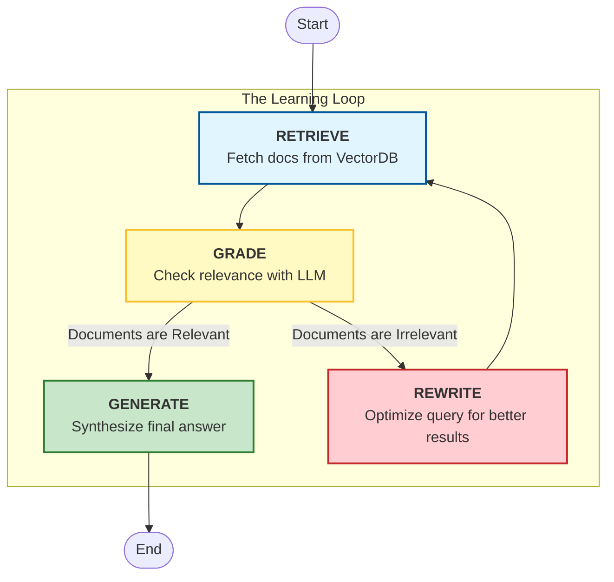

# 🤖 Self-Correcting RAG Researcher

A "Smart" AI Agent capable of performing research, grading its own retrieved information, and **rewriting its search queries** if the initial results are irrelevant. Built with **LangGraph**, **LangChain**, and **ChromaDB**.


## 🧠 The Architecture

Unlike a standard chatbot that just retrieves and answers, this agent employs a **Self-Correction Loop**.



---

## 📂 Project Structure

```text
self-correcting-researcher/
├── chromadb/               # Persistent Vector Database (Generated automatically)
├── src/
│   ├── graph.py            # The "Brain": Defines the workflow and decision logic
│   ├── nodes.py            # The "Muscles": Actual functions (Search, Grade, Write)
│   └── state.py            # The "Memory": Data passed between steps
├── ui.py                   # Streamlit Frontend
├── main.py                 # CLI Execution script
├── .env                    # API Keys (Not committed)
├── pyproject.toml          # Dependencies
└── README.md               # Documentation
```

---

## 🛠️ Module & Function Breakdown

### 1. `src/state.py` (The Memory)
Defines the `GraphState` dictionary. This is the packet of data that moves between every node.
* **`question`**: The user's input (can be rewritten by the agent).
* **`generation`**: The final answer string.
* **`documents`**: A list of retrieved `Document` objects.
* **`retry_count`**: Tracks loop iterations to prevent infinite cycles.

### 2. `src/nodes.py` (The Actions)
Contains the core logic functions.
* **`get_retriever()`**: Initializes ChromaDB with a "Lazy Loading" pattern. It builds the DB from Lilian Weng's blog only if it doesn't already exist on disk.
* **`retrieve(state)`**: Queries ChromaDB for the top 4 documents matching the current `question`.
* **`grade_documents(state)`**: Uses GPT-4o to evaluate if retrieved docs are actually relevant. Filters out the "trash."
* **`rewrite_query(state)`**: If grading fails, this transforms the original question into a better search query using semantic reasoning.
* **`generate(state)`**: Takes the validated documents and synthesizes a final answer.

### 3. `src/graph.py` (The Workflow)
Orchestrates the flow.
* **`build_graph()`**: Connects the nodes using LangGraph.
* **`decide_to_generate(state)`**: The Conditional Edge logic.
    * *If docs found:* -> Go to Generate.
    * *If no docs & retries available:* -> Go to Rewrite Query.
    * *If no docs & max retries hit:* -> Give up and Generate.

---

## 🚀 How to Run

### Prerequisites
* Python 3.12+
* OpenAI API Key
* LangSmith API Key (Optional, but recommended for debugging)

### 1. Installation
Clone the repository and install dependencies using `uv` (recommended) or `pip`.

```bash
# Using uv (Fast)
uv sync

# OR using standard pip
pip install -r requirements.txt
```

### 2. Configuration
Create a `.env` file in the root directory:

```bash
OPENAI_API_KEY=sk-proj-your-key...
LANGCHAIN_TRACING_V2=true
LANGCHAIN_ENDPOINT="[https://api.smith.langchain.com](https://api.smith.langchain.com)"
LANGCHAIN_API_KEY=lsv2-your-key...
LANGCHAIN_PROJECT="Self-Correcting-Researcher"
```

### 3. Execution

**Option A: The Web UI (Streamlit)**
This provides a visual interface with a "Thinking Waterfall" and direct links to LangSmith traces.

```bash
streamlit run ui.py
```

**Option B: The CLI (Terminal)**
Runs the agent in the command line for quick testing.

```bash
python main.py
```

---

## 🐛 Troubleshooting

**Blank Screen in UI?**
If the Streamlit app stays blank, the vector database might be downloading in the background. Check your terminal for progress logs.

**Database Corrupted/Empty Answers?**
If you stopped the script mid-creation, `chroma_db` might be corrupted.
1.  Stop the app (`Ctrl+C`).
2.  Delete the `chroma_db/` folder.
3.  Restart the app to force a rebuild.

**Import Errors?**
Ensure your virtual environment is active and selected in VS Code (`Ctrl+Shift+P` -> `Python: Select Interpreter`).