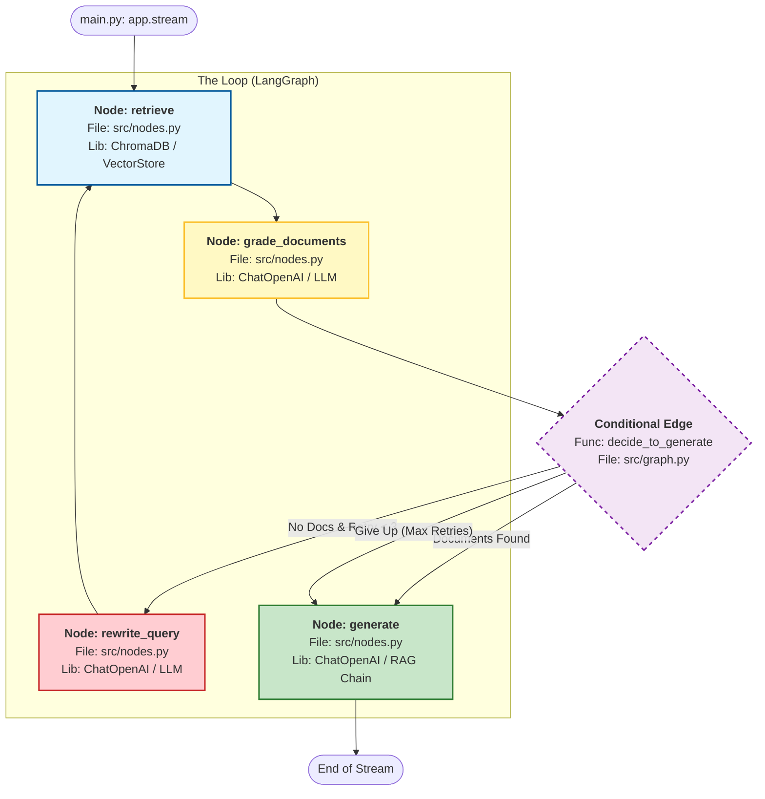

```mermaid
graph TD
    %% NODES
    Start([main.py: app.stream]) --> NodeRetrieve
    
    subgraph "The Loop (LangGraph)"
        NodeRetrieve[<b>Node: retrieve</b><br>File: src/nodes.py<br>Lib: ChromaDB / VectorStore]
        NodeGrade[<b>Node: grade_documents</b><br>File: src/nodes.py<br>Lib: ChatOpenAI / LLM]
        NodeRewrite[<b>Node: rewrite_query</b><br>File: src/nodes.py<br>Lib: ChatOpenAI / LLM]
        NodeGenerate[<b>Node: generate</b><br>File: src/nodes.py<br>Lib: ChatOpenAI / RAG Chain]
    end

    %% DECISIONS
    Decision{<b>Conditional Edge</b><br>Func: decide_to_generate<br>File: src/graph.py}

    %% EDGES
    NodeRetrieve --> NodeGrade
    NodeGrade --> Decision
    
    Decision -- "Documents Found" --> NodeGenerate
    Decision -- "No Docs & Retry < 3" --> NodeRewrite
    Decision -- "Give Up (Max Retries)" --> NodeGenerate
    
    NodeRewrite --> NodeRetrieve
    NodeGenerate --> End([End of Stream])

    %% STYLING
    style NodeRetrieve fill:#e1f5fe,stroke:#01579b,stroke-width:2px
    style NodeGrade fill:#fff9c4,stroke:#fbc02d,stroke-width:2px
    style NodeRewrite fill:#ffcdd2,stroke:#c62828,stroke-width:2px
    style NodeGenerate fill:#c8e6c9,stroke:#2e7d32,stroke-width:2px
    style Decision fill:#f3e5f5,stroke:#7b1fa2,stroke-width:2px,stroke-dasharray: 5 5
```