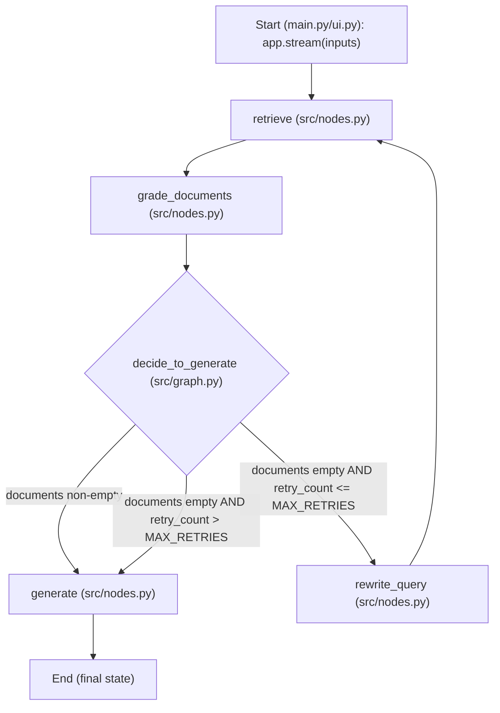
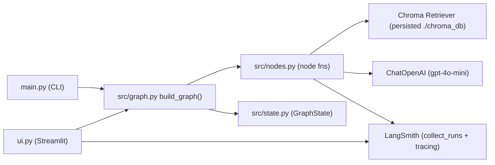

## Architecture & Flow

This doc is the single source of truth for how the repo fits together.

### High-level control flow (LangGraph)

### Module responsibilities

### State (GraphState) fields that drive behavior

- `question`: original user question or rewritten query
- `documents`: retrieved docs (then filtered by `grade_documents`)
- `retry_count`: increments when *no* relevant docs are found, used to stop infinite loops
- `generation`: final answer (set by `generate`)

### Trace/debug fields (LangSmith-friendly, metadata-only)

These fields are returned by nodes so you can inspect behavior in LangSmith without logging raw text:

- `retrieved_docs_meta` (from `retrieve`): per-doc metadata (e.g., `source` URL) + index
- `doc_grades` (from `grade_documents`): per-doc pass/fail + grade + metadata
- `used_docs_meta` (from `generate`): metadata for the final docs used to answer